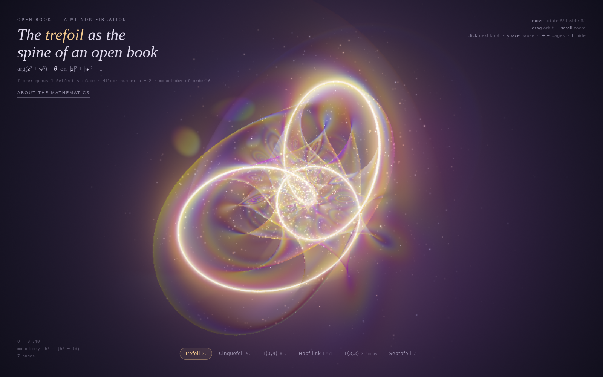
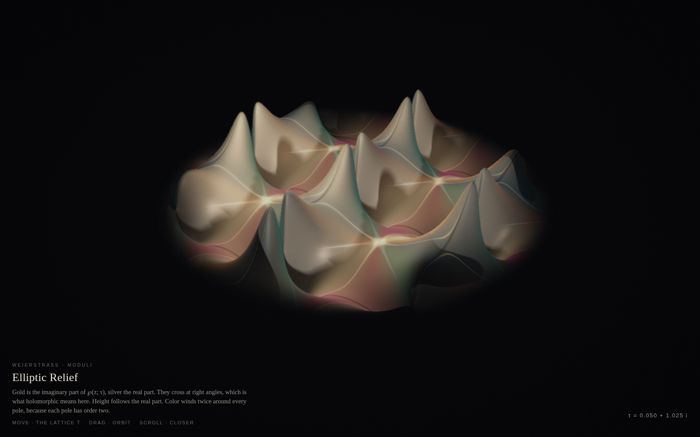
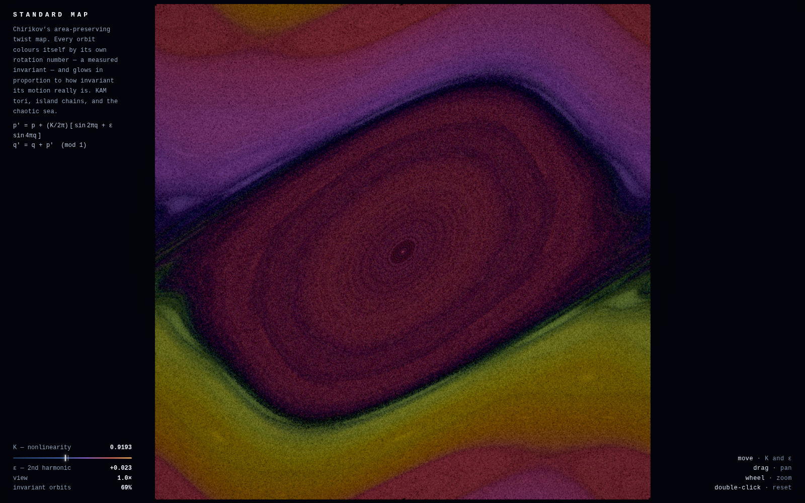
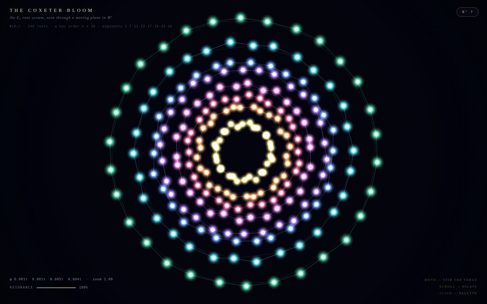
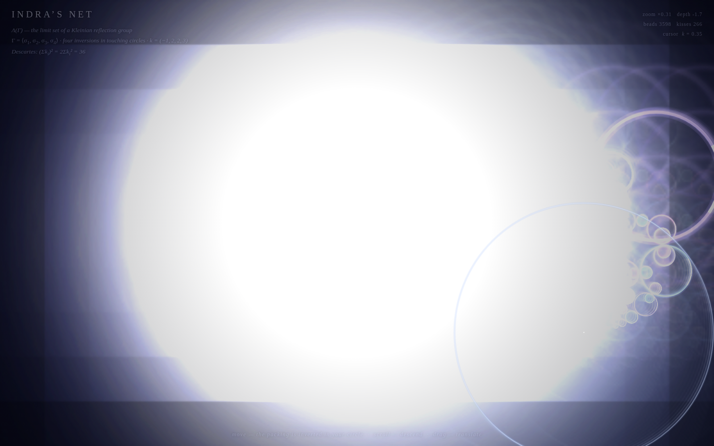
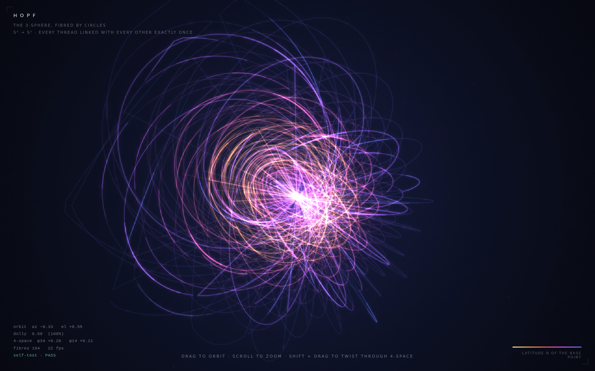

# HTML Experiment

Six self-contained pages. One prompt. Six models.

Each file is a mouse-responsive animation rooted in a different piece of mathematics. There are no libraries, no build step, and no assets beyond the page itself. Move the pointer. Scroll. Drag.

**Live:** [miaai-lab.github.io/HTML-Experiment](https://miaai-lab.github.io/HTML-Experiment/)

The stills in this readme are the opening moment of each page. The pages move.

## The works

### 01 — Open Book

[](opus5-5_218k.html)

**Claude Opus 5.5** · 218k output tokens · [`opus5-5_218k.html`](opus5-5_218k.html)

A Milnor open book. The trefoil is the spine; iridescent pages turn around the knot in the 3-sphere. Move to rotate, drag to orbit, scroll to zoom.

### 02 — Elliptic Relief

[](grok4-7_194k.html)

**Grok 4.7** · 194k output tokens · [`grok4-7_194k.html`](grok4-7_194k.html)

The Weierstrass elliptic function ℘(z; τ). Gold is the imaginary part, silver the real. Height follows the real part, and the color winds twice around every pole. Move to change the lattice τ, drag to orbit, scroll to come closer.

### 03 — Standard Map

[](ds-4.1-flash_359k.html)

**DeepSeek v4.1 Flash** · 359k output tokens · [`ds-4.1-flash_359k.html`](ds-4.1-flash_359k.html)

Chirikov’s area-preserving twist map, drawn as a living phase portrait. Orbits color themselves by rotation number: KAM tori, island chains, and the chaotic sea.

### 04 — The Coxeter Bloom

[](glm-5.3-flash_146k.html)

**GLM 5.3 Flash** · 146k output tokens · [`glm-5.3-flash_146k.html`](glm-5.3-flash_146k.html)

The 240 roots of the E₈ root system, seen through a moving 2-plane in ℝ⁸. On the Coxeter plane they land on eight concentric regular 30-gons. The pointer steers the plane; scroll dilates.

### 05 — Indra’s Net

[](mimo-pro_216k.html)

**MiMo-V2.6-Pro** · 216k output tokens · [`mimo-pro_216k.html`](mimo-pro_216k.html)

The limit set of a Kleinian reflection group: four inversions in mutually tangent circles. Move to invert the packing in your circle, scroll to descend, drag to translate.

### 06 — Hopf

[](mimo-2.6-flash_182k.html)

**MiMo-V2.6-Flash** · 182k output tokens · [`mimo-2.6-flash_182k.html`](mimo-2.6-flash_182k.html)

The Hopf fibration of the 3-sphere: mutually linked circles, projected onto the screen. Canvas 2D only.

## The prompt

Every page was written from this prompt, unchanged:

> write a self contained mimo-pro2.html page that contains a mouse responsive animation that a human viewer would consider stunning and beautiful. it must us e no outside libraries, be mouse responsive (zoom/scroll would be nice, too), work in any web browser, and be rooted in some form of high mathematics (not just random). make it absolutely stunning and make it unique, don't go with the first idea that pops into your head. make something no other LLM will make.

## Run locally

Clone the repository and open `index.html` in a browser. Or open any of the six pages directly. Nothing is served from a network, and nothing has to be installed.

```bash
git clone https://github.com/MiaAI-Lab/HTML-Experiment.git
cd HTML-Experiment
# then open index.html
```

A local static server also works, if you want clean URLs:

```bash
python3 -m http.server 8080
```

Then visit `http://127.0.0.1:8080/`.

## What is in the repository

| File | What it is |
| --- | --- |
| `index.html` | Gallery of the six pages, with a still before each link |
| `opus5-5_218k.html` | Open Book — Claude Opus 5.5 |
| `grok4-7_194k.html` | Elliptic Relief — Grok 4.7 |
| `ds-4.1-flash_359k.html` | Standard Map — DeepSeek v4.1 Flash |
| `glm-5.3-flash_146k.html` | The Coxeter Bloom — GLM 5.3 Flash |
| `mimo-pro_216k.html` | Indra’s Net — MiMo-V2.6-Pro |
| `mimo-2.6-flash_182k.html` | Hopf — MiMo-V2.6-Flash |
| `screenshots/` | The stills used by the index and this readme |

Output-token counts are the figures recorded for each generation. Two of the pages draw with WebGL (Open Book, Elliptic Relief). The other four use Canvas 2D. All six are meant to run in a current browser with no plugins.
